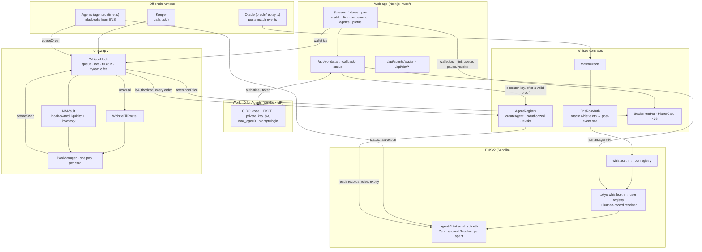

# Whistle

**Trade player cards mid-match as goals and red cards move prices, or let your agent trade for you.**

**Live demo:** https://whistle-weld.vercel.app · **Video:** <VIDEO_URL> · **ETHGlobal showcase:** <SHOWCASE_URL>

ETHGlobal Tokyo 2026 · Sepolia · ENSv2 · Uniswap v4 · World ID for Agents

---

## What it is

**Player cards and the pot.** Every player in a fixture is an ERC-20 card. Before kick-off you mint
cards at a fixed pre-match price, and the USDC you pay goes into the fixture's pot. At full time the
oracle posts final scores and the pot is split by them: every card redeems at the same rate for
everyone holding it. A card's live price is its share of the pot, `R = Pot · E / D` — the player's
expected score over the sum of all players' — so a goal, a red card or a substitution moves it.

**A 30-second in-play delay, one price per tick.** During the match, buys and sells are queued in a
Uniswap v4 hook and become fillable only 30 seconds after they are placed. A keeper then clears each
card's book in batches: buys and sells are netted against each other, whatever is left is rationed
pro-rata, and every order in the batch fills at the same oracle price. Nobody gets to trade on a goal
before the price has seen it.

**Agents are ENS names; any increase in authority needs World ID.** An agent is an ENSv2 subname,
`agent-N.<user>.whistle.eth`, with its own resolver. Its mandate — playbook, spend cap, max price move,
fixture, expiry — is text records its user controls, and the hook reads them live on every order.
Creating an agent, raising its cap and resuming it each require a fresh World ID proof, validated on
the server; pausing, lowering the cap and revoking are one click and never need verification.

---

## Architecture



---

## How we use each sponsor

### ENS — Best Use of ENSv2

- **A hierarchy of registries, not a flat list.** `whistle.eth` points at Whistle's root registry;
  each user gets a name there (`tokyo.whistle.eth`) with **a registry of their own**; each agent is a
  subname in its user's registry (`agent-N.tokyo.whistle.eth`). The user's registry is where the off
  switch lives.
- **One Permissioned Resolver per agent**, deployed through ENS's `VerifiableFactory` inside
  `createAgent`, because resolver roles are scoped per resolver instance and key, not per name.
- **Enhanced Access Control splits write rights per record key** between three parties: the **agent**
  writes `status`, `last-action`, `pnl-live`; the **user** writes `strategy`, `spend-cap`,
  `slippage`, `fixture`; the **platform** writes `matches-played`, `pnl-history`, `revoked-at`.
  `AgentRegistry` then drops its own `ROLE_SET_TEXT` in the same transaction.
- **Agent names are non-transferable, expiring and revocable.** Omitting `ROLE_CAN_TRANSFER_ADMIN`
  makes them non-transferable, the registry expiry is the mandate's end, and revoking unregisters the
  name so the next authorization check fails at the registry read.
- **ENS is the permission system, read live.** `WhistleHook.queueOrder` calls
  `AgentRegistry.isAuthorized` on every agent order: registration status, expiry, the agent's role,
  the `fixture` record and the `spend-cap` record — about 88k gas, no cache. The oracle's right to post
  events is also an ENS fact: whoever owns `oracle.whistle.eth` holds the post-event role.
- **Resolution** goes through `UniversalResolverV2` (`resolve(name, data)`). Whistle does not use
  wildcard resolution: every agent name is a real registered subname.
- **The human record.** After a verified World ID proof, the server writes
  `human.agent-N = keccak256(iss ‖ sub)` on the user's name, through a Permissioned Resolver on
  `tokyo.whistle.eth`; the profile shows the agent as **human-backed · World ID**.
- **ENSIP-26 / ENSIP-25.** Our records are mandate and state records, not discovery records: we do not
  write ENSIP-26's `agent-context` or `agent-endpoint[web]`, nor ENSIP-25's
  `agent-registration[<registry>][<agentId>]`, although `AgentRegistry` is exactly the kind of registry
  ENSIP-25 describes. Adding them would need a contract change, because text-record roles are granted
  only inside `createAgent`. Full mapping in [ENS_FEEDBACK.md §6](ENS_FEEDBACK.md#6-mapping-agent-names-to-ensip-26-and-ensip-25).

### Uniswap v4 — Best Uniswap Stack Contribution

- **A v4 pool per card**: the card against wUSDC, dynamic fee, tick spacing 60, and the fixture's
  `WhistleHook` (permissions `beforeSwap` + `beforeSwapReturnDelta`, mined into the hook address).
- **The in-play delay and uniform-price fills.** `queueOrder` records an order and its reference price;
  `tick()` admits only orders older than the 30-second delay, nets each card's buys against its sells,
  rations the rest pro-rata, and fills everything at one price. The residual goes through
  `WhistleFillRouter` as a real `PoolManager.swap`, and `_beforeSwap` consumes it with a
  `BeforeSwapDelta` at the oracle price.
- **A dynamic fee, set per swap by the hook**: 0.30% base, +0.50% within 60 seconds of a match event,
  plus the pool's divergence from the reference price, capped at 2%. The fee splits 90/10 between
  the vault and the protocol; agent orders pay a further 0.10%, which goes to the protocol.
- **Hook-owned liquidity with a custom curve during live play.** `MMVault` holds each card's
  concentrated position (±10% around the pre-match price) and its fill inventory as ERC-6909 claims.
  While a match is live, fills bypass the curve and settle against that inventory at the reference
  price; direct swaps revert. Before kick-off the pools trade as ordinary hooked AMM pools.
- **Visible in the Uniswap app.** Every pool, per fixture, with a link to its Uniswap page:
  [docs/uniswap-pools.md](docs/uniswap-pools.md).

### World ID for Agents — Best Use of World ID for Agents

- **Protected actions:** create an agent, raise an agent's spend cap, and resume a paused agent (a
  raise from 0).
- **The rule:** increasing an agent's authority needs a fresh World ID proof; decreasing it never does.
  Pause, lower the cap and revoke are ordinary wallet transactions.
- **Backend validation.** The browser never performs a protected action. `/api/world/start` stores the
  pending action server-side for five minutes and returns the authorize URL (code + PKCE S256, nonce,
  `state` = the pending id, `max_age=0`, `prompt=login`). `/api/world/callback` redeems the code with a
  fresh `private_key_jwt` assertion, validates the ID token (signature, iss, aud, exp, nonce, state,
  `auth_time` after the attempt began), and only then performs the action with the operator key. A
  raise must be a real increase, and once an agent is bound, must come from the same human.
- **The denied or expired path.** Any failure — IdP denial, expiry, a stale `auth_time`, a replayed
  code or state — makes no chain call and redirects back with the reason; the page says
  "Not approved within five minutes — nothing was changed."
- **Sandbox caveat.** The World ID sandbox uses fake identities and mocked proofs; nothing here is a
  production-grade proof of personhood.

---

## Where to look

Line ranges verified against the code at this commit.

### ENSv2

| What | Where |
|---|---|
| Register a user's name and give it its own registry | [`AgentRegistry.sol:203-235`](contracts/src/integrations/ens/AgentRegistry.sol#L203-L235) |
| **`createAgent`**: subname, per-agent resolver, mandate records, drop own write role | [`AgentRegistry.sol:252-297`](contracts/src/integrations/ens/AgentRegistry.sol#L252-L297) |
| Initial records (no `linkToNode` step) | [`AgentRegistry.sol:311-323`](contracts/src/integrations/ens/AgentRegistry.sol#L311-L323) |
| **Split resolver rights** between agent, user and platform | [`AgentRegistry.sol:327-345`](contracts/src/integrations/ens/AgentRegistry.sol#L327-L345) |
| Revoke: revoke roles and unregister the name | [`AgentRegistry.sol:356-365`](contracts/src/integrations/ens/AgentRegistry.sol#L356-L365) |
| **`isAuthorized`**, read on every order | [`AgentRegistry.sol:370-397`](contracts/src/integrations/ens/AgentRegistry.sol#L370-L397) |
| The oracle role from `oracle.whistle.eth` | [`EnsRoleAuth.sol:45-56`](contracts/src/integrations/ens/EnsRoleAuth.sol#L45-L56), used by [`MatchOracle.sol:68-70`](contracts/src/core/MatchOracle.sol#L68-L70) |
| ENSv2 interfaces, pinned to the deployment tag | [`IENSv2.sol`](contracts/src/integrations/ens/IENSv2.sol), [`EnsSepolia.sol`](contracts/src/integrations/ens/EnsSepolia.sol) |
| The human record: value, write, same-human check | [`web/lib/world/actions.ts:63`](web/lib/world/actions.ts#L63), [`121-136`](web/lib/world/actions.ts#L121-L136) |
| The human-record resolver on `tokyo.whistle.eth` | [`scripts/setup-human-resolver.ts:75-131`](scripts/setup-human-resolver.ts#L75-L131) |

### Uniswap v4

| What | Where |
|---|---|
| **`getHookPermissions`**: `beforeSwap` + `beforeSwapReturnDelta` | [`WhistleHook.sol:228-245`](contracts/src/integrations/uniswap/WhistleHook.sol#L228-L245) |
| Dynamic fee per swap | [`WhistleHook.sol:335-345`](contracts/src/integrations/uniswap/WhistleHook.sol#L335-L345) |
| **`queueOrder`**: authorization at submit, reference price recorded | [`WhistleHook.sol:380-433`](contracts/src/integrations/uniswap/WhistleHook.sol#L380-L433) |
| **`tick`**: paginated by card; the 30-second delay gate | [`WhistleHook.sol:493-509`](contracts/src/integrations/uniswap/WhistleHook.sol#L493-L509), [`557`](contracts/src/integrations/uniswap/WhistleHook.sol#L557) |
| Live ENS authorization, memoized per tick | [`WhistleHook.sol:666-679`](contracts/src/integrations/uniswap/WhistleHook.sol#L666-L679) |
| **Netting**, then pro-rata rationing at one price | [`WhistleHook.sol:712-733`](contracts/src/integrations/uniswap/WhistleHook.sol#L712-L733), [`808-829`](contracts/src/integrations/uniswap/WhistleHook.sol#L808-L829) |
| The residual through the router | [`WhistleHook.sol:860-869`](contracts/src/integrations/uniswap/WhistleHook.sol#L860-L869) |
| **Fee split**: 90/10 plus the agent surcharge | [`WhistleHook.sol:956-972`](contracts/src/integrations/uniswap/WhistleHook.sol#L956-L972) |
| **`_beforeSwap`**: reject direct swaps while live, fill at `R` | [`WhistleHook.sol:992-1014`](contracts/src/integrations/uniswap/WhistleHook.sol#L992-L1014) |
| The `BeforeSwapDelta` and its settlement against vault claims | [`WhistleHook.sol:1018-1050`](contracts/src/integrations/uniswap/WhistleHook.sol#L1018-L1050) |
| **`WhistleFillRouter`**: a different `msg.sender`, so `beforeSwap` fires | [`WhistleFillRouter.sol:76-134`](contracts/src/integrations/uniswap/WhistleFillRouter.sol#L76-L134) |
| Hook-owned liquidity: ±10% position plus inventory | [`MMVault.sol:239-305`](contracts/src/integrations/uniswap/MMVault.sol#L239-L305) |

### World ID

| What | Where |
|---|---|
| **Start**: store the pending action, build the authorize URL | [`web/app/api/world/start/route.ts:26-74`](web/app/api/world/start/route.ts#L26-L74) |
| **Callback**: code exchange with `private_key_jwt`, then the action | [`web/app/api/world/callback/route.ts:23-69`](web/app/api/world/callback/route.ts#L23-L69) |
| Status, polled by the page that started the attempt | [`web/app/api/world/status/route.ts:10-15`](web/app/api/world/status/route.ts#L10-L15) |
| **Token validation**: signature, iss, aud, exp, nonce, `auth_time` | [`web/lib/world/jwt.ts:57-92`](web/lib/world/jwt.ts#L57-L92) |
| The callback as a pure function: nothing runs before validation | [`web/lib/world/flow.ts:37-75`](web/lib/world/flow.ts#L37-L75) |
| Single-use pending attempts, shared store | [`web/lib/world/store.ts:152-158`](web/lib/world/store.ts#L152-L158) |
| **Protected-action executor**: create, raise/resume, one at a time | [`web/lib/world/actions.ts:152-178`](web/lib/world/actions.ts#L152-L178), [`236-265`](web/lib/world/actions.ts#L236-L265) |
| **Increase/decrease rule**, server: only an increase is accepted | [`web/lib/world/actions.ts:200-234`](web/lib/world/actions.ts#L200-L234) |
| Increase/decrease rule, UI: raise → World ID; lower and pause → wallet | [`web/components/CapControls.tsx:65-91`](web/components/CapControls.tsx#L65-L91) |
| Failure-path tests: bad signature, wrong aud, stale `auth_time`, state mismatch, replayed code | [`web/lib/world/flow.test.ts`](web/lib/world/flow.test.ts) |

---

## Deployments (Sepolia, 11155111)

Source of truth: [`deployments/`](deployments/). Explorer: Etherscan.

### Shared contracts

| Contract | Address |
|---|---|
| `AgentRegistry` | [`0x0fD44F0e192f0091439554A5Ed8195F5F0672F3D`](https://sepolia.etherscan.io/address/0x0fD44F0e192f0091439554A5Ed8195F5F0672F3D) |
| `EnsRoleAuth` | [`0x938948Aa85D5582d6286fcE21290d4aDAF08CF64`](https://sepolia.etherscan.io/address/0x938948Aa85D5582d6286fcE21290d4aDAF08CF64) |
| `MatchOracle` | [`0x90392a3ab5c5A4176d1b8d68835D6D26FBe2D588`](https://sepolia.etherscan.io/address/0x90392a3ab5c5A4176d1b8d68835D6D26FBe2D588) |
| `FixtureFactory` | [`0x8CaE45F405739bf362D7c66f538fCeF59dA32c8C`](https://sepolia.etherscan.io/address/0x8CaE45F405739bf362D7c66f538fCeF59dA32c8C) |
| `PlayerCard` implementation (cloned per card) | [`0x408D064eA0E9c98164d9f5C63a66ade5D1c48520`](https://sepolia.etherscan.io/address/0x408D064eA0E9c98164d9f5C63a66ade5D1c48520) |
| `MockUSDC` (wUSDC) | [`0x7f46405B3757523c3B30C0bb06585bBa16619490`](https://sepolia.etherscan.io/address/0x7f46405B3757523c3B30C0bb06585bBa16619490) |
| Root registry (`whistle.eth`'s subregistry) | [`0xCeBF767D99e04A3f8934B29331b5165B0C1Cab3C`](https://sepolia.etherscan.io/address/0xCeBF767D99e04A3f8934B29331b5165B0C1Cab3C) |
| `tokyo.whistle.eth` user registry | [`0xF389553b354D4ceB841a213D35E09599b6Be1249`](https://sepolia.etherscan.io/address/0xF389553b354D4ceB841a213D35E09599b6Be1249) |
| `tokyo.whistle.eth` human-record resolver | [`0x966fc77f65ce3BC37c45b5C31F70572c71fc7abF`](https://sepolia.etherscan.io/address/0x966fc77f65ce3BC37c45b5C31F70572c71fc7abF) |
| Operator / owner of `whistle.eth` | [`0x68343Aa0598b7FCAA102769D172e59cdDfae10f2`](https://sepolia.etherscan.io/address/0x68343Aa0598b7FCAA102769D172e59cdDfae10f2) |
| Uniswap v4 `PoolManager` (not ours) | [`0xE03A1074c86CFeDd5C142C4F04F1a1536e203543`](https://sepolia.etherscan.io/address/0xE03A1074c86CFeDd5C142C4F04F1a1536e203543) |

### Fixtures

All four replay Chelsea 1–1 Barcelona (Champions League semi-final, 6 May 2009).

| | Demo 1 `2026092701` | Demo 2 `2026092702` | Demo 3 `2026092703` | Demo 4 `2026092704` |
|---|---|---|---|---|
| State | settled 1–1 | pre-match | pre-match | pre-match |
| Pools | 6 | 11 | 11 | 11 |
| `SettlementPot` | [`0xe8C9…692C`](https://sepolia.etherscan.io/address/0xe8C9B47388affD069110003Ada40835d32CD692C) | [`0x6B4b…93c5`](https://sepolia.etherscan.io/address/0x6B4b161d35d3d00ED5bE4105bEb56539b25493c5) | [`0xf68c…a70c`](https://sepolia.etherscan.io/address/0xf68c093287A6a5ad8cd78A3650f5B20e3cf2a70c) | [`0x2B24…4F81`](https://sepolia.etherscan.io/address/0x2B24f00FF4A2f0E089E5428b602A0d1D0A0E4F81) |
| `WhistleHook` | [`0x4b73…8088`](https://sepolia.etherscan.io/address/0x4b7373E4512C45Dff92b1c4a6048Cd3240218088) | [`0xbd91…4088`](https://sepolia.etherscan.io/address/0xbd91503c4dd270007eb697ddeab30fc87dea4088) | [`0x071c…8088`](https://sepolia.etherscan.io/address/0x071cFE36286Bec972871dc38d2FFdeC7b04c8088) | [`0x1d3b…4088`](https://sepolia.etherscan.io/address/0x1d3b9458e97827fa32225de2534a4f8669374088) |
| `WhistleFillRouter` | [`0x0368…319F`](https://sepolia.etherscan.io/address/0x0368256F159Df7CC5E15D832F09bD1DFD189319F) | [`0xaa47…b7ad`](https://sepolia.etherscan.io/address/0xaa47ab54bc9997389214d2dc3cdbb0a7b700b7ad) | [`0xDEd3…E3E0`](https://sepolia.etherscan.io/address/0xDEd37f86d53daB41CF8218c5BebA92f2B3c9e3E0) | [`0x1cc6…4140`](https://sepolia.etherscan.io/address/0x1cc6df3101d97f6eb61b5fb6efe1c89dba414140) |
| `MMVault` | [`0x1773…0EB9`](https://sepolia.etherscan.io/address/0x1773Bf783Ba53dC84aD9241286105A2472D30EB9) | [`0x314b…337e`](https://sepolia.etherscan.io/address/0x314bdb1c7798ef1c211e7cd154256426821d337e) | [`0x6727…1cF1`](https://sepolia.etherscan.io/address/0x67277BB47594AA8e787bC9f0d3182e9Db2131cF1) | [`0xdca7…e521`](https://sepolia.etherscan.io/address/0xdca76e521f9930e96dbad4be929b23b8f484e521) |

Every hook address ends in `…088`: the low bits of a v4 hook address are its permission flags, so each
hook was mined by CREATE2 salt search.

---

## Agents

Whistle's agents are **policy-bounded autonomous agents**: deterministic playbooks whose action space is
enforced on-chain.

- **Deterministic playbooks.** Three templates in [`agent/templates/`](agent/templates/), chosen by the
  agent's own `strategy` record: `protect` sells part of a held card that just fell, or on a red card;
  `momentum` buys the card that rose hardest on the last event; `contrarian` buys the hardest faller
  still on the pitch. The same event always produces the same decision.
- **Autonomous.** Each agent watches match events, decides and signs with its own key; nobody approves
  an order between the goal and the trade. The runtime is [`agent/runtime.ts`](agent/runtime.ts); in
  the web app, Whistle-managed agents run from the in-page simulation.
- **Bounded on-chain.** The limits are not in the agent. `queueOrder` calls `isAuthorized` on every
  order, reading records the agent has no role to write. An agent cannot exceed its mandate by choosing
  to, and a pause (`spend-cap = 0`) or revoke by its user binds on the next block.
- **Managed keys.** The New agent form never asks for a key: the server assigns the next unused
  Whistle-managed key for the fixture, funds its gas and runs it.
- **External agent addresses.** `createAgent` takes any address as the agent, so an agent you run
  yourself — your key, your code — can get a mandate with one call from the operator, and the same
  on-chain checks bound it on every order:

```bash
cast send $AGENT_REGISTRY \
  "createAgent((address,address,uint256,uint256,uint256,uint256,uint64,uint256))" \
  "($USER,$AGENT,$FIXTURE_ID,2,500000000,1000,$EXPIRY,$SALT)" \
  --private-key $DEPLOYER_PRIVATE_KEY --rpc-url $SEPOLIA_RPC_URL
# template 2 = momentum · cap 500 USDC (6 dp) · max move 1000 bps · EXPIRY a unix time
```

It needs its own gas, USDC and `approve(hook)`; run it with `agent/runtime.ts` (`AGENT_PRIVATE_KEYS`) or
your own signer.

---

## World ID integration debrief

- **Time to first success:** 56 minutes from starting research to the first end-to-end success — a
  fresh sandbox proof, the code redeemed with a `private_key_jwt` assertion, the ID token validated, and
  `createAgent` performed server-side with the human record written. Client registration took 24 of
  those minutes.
- **Friction:** the sandbox app access was withdrawn and replaced with mocked proofs, so the sign-in
  page approves itself in about two seconds with a fresh fake identity and `auth_time` freshness cannot
  really be demonstrated; callbacks must be HTTPS, which meant a local CA and a TLS proxy for
  `localhost`; the MCP portal tools need a separate Google-scoped sign-in, and our client did not act on
  the `insufficient_scope` challenge, so we registered in the portal UI; the browser flow has no Deny
  (`/deny` returns `invalid_request`), so "denied" is "not approved within five minutes"; the sector is
  the redirect hostname and is fixed at registration, so a deployed domain needs a second client.
- **Missing capability or documentation:** sandbox controls to force deny, expiry or a stale
  `auth_time`, and a stable fake identity; documented Approval-link hand-off semantics; the full set of
  `error` values a callback can receive.
- **The one improvement with the greatest impact:** let the relying party say what is being approved —
  a `binding_message` or `authorization_details` shown on the approval screen and signed into the ID
  token — so a human approves "raise agent-10's cap from 1 to 300 USDC", not just a sign-in.

---

## Setup and testing

Requirements: Node 20, pnpm 9, Foundry.

```bash
git clone --recurse-submodules https://github.com/rohitshukla11/Whistle.git
cd Whistle
pnpm install

pnpm test          # forge test: 150 tests (Sepolia fork tests skip without SEPOLIA_RPC_URL)
pnpm test:all      # forge test + TypeScript tests (oracle resend, World ID callback) + typecheck

cd web && pnpm install && pnpm build
```

With `SEPOLIA_RPC_URL` set (copy `.env.example` to `.env`), the fork tests run against the real
Sepolia `PoolManager`, `PositionManager` and ENSv2 beta.

- **Run locally over HTTPS** (World ID callbacks must be HTTPS): [docs/run-local.md](docs/run-local.md)
- **Deploy to Vercel**: [docs/vercel.md](docs/vercel.md)
- **The Uniswap pools**: [docs/uniswap-pools.md](docs/uniswap-pools.md)
- **Sponsor feedback**: [FEEDBACK.md](FEEDBACK.md) (Uniswap), [ENS_FEEDBACK.md](ENS_FEEDBACK.md) (ENS)

---

## Team

| Name | Role | X | GitHub |
|---|---|---|---|
| <NAME> | <ROLE> | <X_HANDLE> | <GITHUB_HANDLE> |
| <NAME> | <ROLE> | <X_HANDLE> | <GITHUB_HANDLE> |

---

## Known limitations and roadmap

- **The first minter of a card is refused by the holder cap.** `PlayerCard` caps any wallet at 5% of a
  card's supply, so the first mint of a card nobody holds would be 100% of it and reverts
  `HolderCapExceeded`. The demo seeds every pooled card with a float and exempts the operator; the real
  fix is a supply floor below which the cap does not apply.
- **One venue per fixture.** `MMVault.pot` is immutable and `WhistleHook.setVault` is one-shot, so each
  fixture deploys its own hook, router and vault. Roadmap: a shared venue whose vault is keyed per
  fixture, the way the hook already keys pots.
- **The demo's operator key lives on the server.** World ID-protected actions are signed by the
  operator on the server after a valid proof, because `createAgent` is operator-only. Roadmap: users
  sign their own mandates, and the server only attests the proof.
- **Live fills bypass the curve.** During a match every fill settles against vault inventory at the
  reference price, so the pool's liquidity sits idle. Roadmap: open the vault to outside LPs, and a
  re-centring liquidity hook that keeps concentrated liquidity around the oracle price.
- **Production belongs on an L2**, with off-chain matching and on-chain settlement: the batch clearing
  is already a single-price auction, which is what makes that split safe.
- **The oracle is a replay.** Match events come from a replayed historical match posted by a key that
  holds `oracle.whistle.eth`; production needs a licensed live feed (an adapter exists in
  [`oracle/live-adapter.ts`](oracle/live-adapter.ts)).

---

## License

[MIT](LICENSE)
